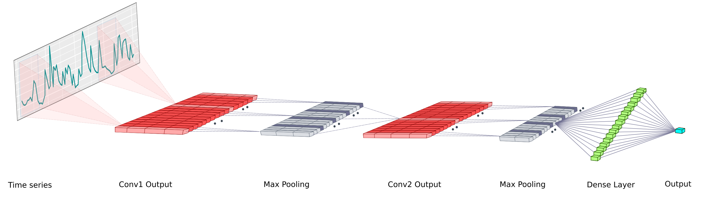
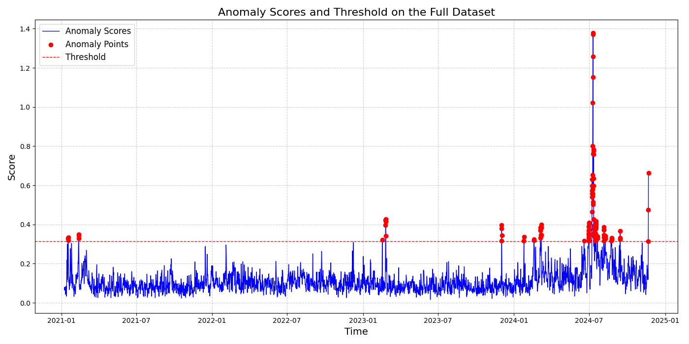

# DeepAnT: A Deep Learning Approach for Unsupervised Anomaly Detection in Time Series

This repository contains an adapted implementation of the paper **"DeepAnT: A Deep Learning Approach for Unsupervised Anomaly Detection in Time Series"**, originally authored by Mohsin Munir, Shoaib Ahmed Siddiqui, Andreas Dengel, and Sheraz Ahmed. The original paper can be found [here](https://ieeexplore.ieee.org/document/8581424).

This version has been customized and extended to fit maritime datasets, with additional enhancements and features to improve usability and functionality.

---

## About the Paper

The original paper introduces **DeepAnT**, a deep learning model for unsupervised anomaly detection in time series data. This implementation integrates the core concepts from the paper, including:

- **Model Structure**:  
  A sequence of convolutional layers followed by fully connected layers, capturing both local patterns and long-term dependencies.  
  

- **Unsupervised Learning**:  
  Designed for applications where labeled anomalies are scarce.

- **Anomaly Detection**:  
  Compares predicted values with actual values to compute anomaly scores.

---
While the foundation remains aligned with the paper, modifications have been made to adapt the algorithm to maritime datasets and improve its utility.

## Updates and Enhancements

### Modifications to Fit Maritime Datasets
- **Dataset Compatibility**:  
  Added support for maritime datasets with additional preprocessing and analysis tailored to domain-specific requirements.

  The data manipulation script used in this project is located in [`DeepAnT/data/raw_data/manipulate_data.ipynb`](data/raw_data/manipulate_data.ipynb).

  To view or edit the data preprocessing steps, navigate to the notebook directly at the path above.

- **Enhanced Algorithm**:  
  Adjustments to the core algorithm improve its accuracy and adaptability to diverse time series characteristics.

## Implementation Details

This implementation follows the architecture and methodology described in the paper using PyTorch and PyTorch Lightning.

- **Sliding Window**: Preprocesses the time series data using a sliding window approach.
- **Forecasting-Based Model**: Predicts the next value(s) in the sequence for anomaly detection.
- **Training and Validation**: 
    - Initial training without considering the validation loss.
    - After the initial training, the best model is selected based on the validation loss, using early stopping to prevent overfitting.
- **Dynamic Threshold Calculation**: Threshold for anomaly detection procedure is dynamically calculated based on the anomaly scores' statistics.
- **Visualization**: Provides visualizations for predicted sequences as well as detected anomalies.


### New Features
1. **`inference.py` Script**:  
   - Analyzes the entire dataset to generate detailed anomaly results.
   - Outputs:
     - **Excel File**: `anomaly_results_summation.xlsx` with columns: `timestamp`, `anomaly_score`, and `anomaly_level`. Among them, `anomaly_level` is the level of anomaly (normal, mild anomaly, moderate anomaly, severe anomaly). We use '3-sigma' rule to divide anomalies into four levels, where we usually assume that 99.7% of normal data points lie within 3 standard deviations from the mean.
  

     - **Visualizations**: `full_dataset_anomaly_plot.png` and `full_dataset_anomaly_levels_plot.png`.

2. **Configurable Timestamps**:  
   - In `trainer.py`:
     ```python
     timestamps = pd.read_csv(
         os.path.join("./data", self.config["dataset_name"], self.config["specific_dataset"]),
         parse_dates=["summary_time"]
     )["summary_time"].values
     ```
     If your dataset uses a different date column, update the `parse_dates` argument accordingly.

   - In `data_utils.py`:
     ```python
     data = pd.read_csv(os.path.join(path, specific_data), index_col="summary_time", parse_dates=["summary_time"])
     logger.info(f"Dataset shape: {data.shape}")
     data = data.drop(columns=['summary_time'], errors='ignore')
     ```
     Similarly, modify `parse_dates` if necessary to match your dataset.

3. **Adaptation to Various Datasets**:  
   Until now, all tested datasets used the column name `summary_time`. If this changes, ensure that `parse_dates` is updated across relevant files (`trainer.py`, `data_utils.py`, and `inference.py`).

---

## Usage

### Setup
1. **Clone the repository**:
    ```bash
    git clone https://github.com/EnsiyeTahaei/DeepAnT.git
    cd DeepAnT
    ```
2.	**Install dependencies**:

    ```bash
    pip install -r requirements.txt
    ```

3.	Run the main script:
    ```bash
    python main.py --dataset_name Port_Data
    ```
• You can change the dataset name in the [`config.yaml`](config.yaml)

4.	Run the inference script:
    ```bash
    python inference.py
    ```
• Outputs anomaly results and visualizations for the entire dataset.

• You should change the `city` name in the main function for different datasets.

---
## Result Sample
The model was trained and validated on the Houston dataset [`Houston dataset`](data/smoothed_data/smoothed_Houston_data.csv) with shape (8523, 12). Below are key results from the training run:

### Training and Validation
• Final Training Loss: 0.0208

• Final Validation Loss: 0.0635

### Anomaly Detection
• Dynamic Threshold for test dataset: 0.3139

• Detected Anomalies:
Indices: [`anomaly timestamps`](experiment/Houston_port/full_dataset_anomaly_timestamps.json)


### Visualization

• Detected Anomalies for whole dataset by [`inference.py`](inference.py):


Summation for anomaly scores and anomaly division with corresponding timestamps:
[`summation table`](experiment/Houston_port/anomaly_results_summation.xlsx)

## License

This project is licensed under the MIT License.


## Citation

If you use this code for your research, please cite the original paper:

@ARTICLE{8581424,
  author={Munir, Mohsin and Siddiqui, Shoaib Ahmed and Dengel, Andreas and Ahmed, Sheraz},
  journal={IEEE Access}, 
  title={DeepAnT: A Deep Learning Approach for Unsupervised Anomaly Detection in Time Series}, 
  year={2019},
  volume={7},
  pages={1991-2005},
  doi={10.1109/ACCESS.2018.2886457}
}

